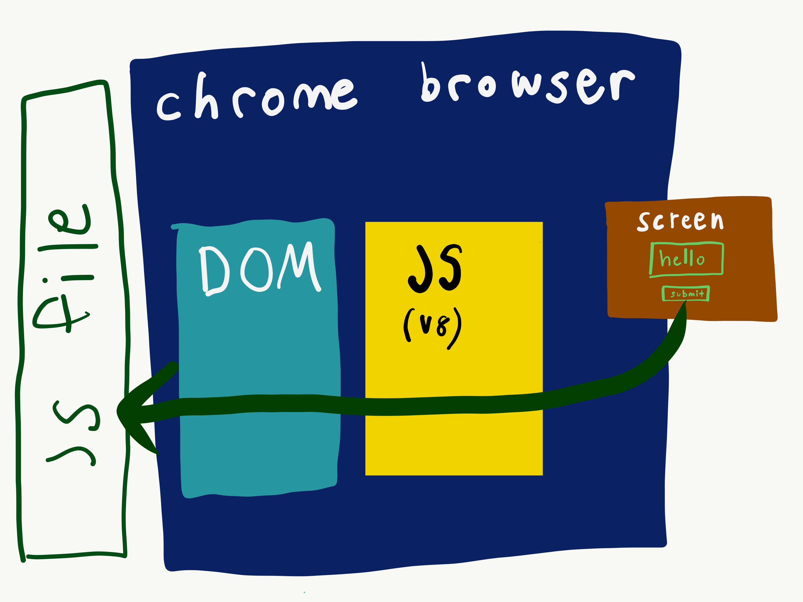
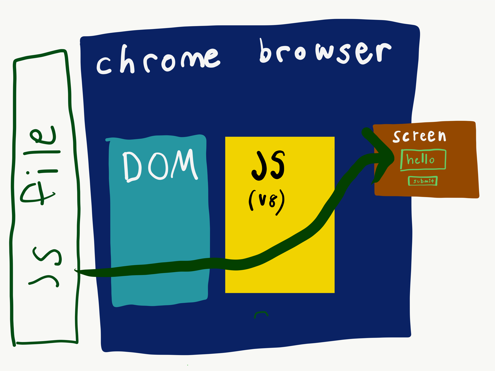

# 12.1: Browser Applications with DOM

We've completed the basics of how to code with JavaScript.

Our hope is that you have some idea of how a program goes from conception to working code.

Now we'll describe more about the environment we've been working with in the browser.


This section is meant as a crash course on the rest of the browser system.

Don't worry if it seems like a lot of content, as it covers what would be enough for a whole other course.

Here we can distinguish between **domain knowledge** -technical knowledge of a specific system, and general programming knowledge, which we've been focusing on during this course.

For a different kind of system \(a back-end web system, for example, or a mobile device system\) we would just have to define a different system of inputs and outputs. The middle section of our program, the equivalent `main` function would still need to do the same actions.




## Inputs and Outputs

The browser is an application that deals with HTML code. This HTML code gives basic instructions about what kind of thing to display on the page.

HTML differs from JavaScript in that HTML has no logic, no control flow and doesn't hold data. It simply describes the way a set of content should be displayed.

In the end the task of JavaScript is to use this environment of HTML displaying functionality to give the users tools \([affordance ](https://uxplanet.org/ux-design-glossary-how-to-use-affordances-in-user-interfaces-393c8e9686e4)in UX language\) to give input to the program, and components to display the output of the program.

We have purposely described inputs and outputs very narrowly, but the next step in understanding what a real front-end application does and is capable of, is to begin to describe all of the different kinds of inputs that can be given to the program, and all the different outputs that can be generated.

#### DOM Input - User Action to JS Function Execution



**Our javascript is capable of taking as input:**

* Any user mouse movement within the browser screen.
* Any element on the page they've clicked on.
* Any radio button, drop down or checkbox they've interacted with.
* And more....

#### DOM Output - JS to Element to Browser



**Out JavaScript is capable of giving output as:**

* Any HTML element, with any CSS style applied to it.

The power of JavaScript is that our program can take in and control anything the user does in a browser page.

## DOM - Document Object Model

DOM is the name of the set of JavaScript variables that represent everything within the browser.

We've already seen one: `console.log`. Otherwise you could write a program that, for example, calculates prime numbers, or the places in Pi and it doesn't have to otherwise interact with the browser itself, or even give any output!

When we want our JavaScript to take in any inputs or give any outputs we have to use some part of the DOM functionality.

Besides `console.log` \(specifically `console`\), the other major variables that represent the DOM are `window` and `document`.

DOM is also referred to as an API - an Application Programming Interface - the interface or representation of everything that happens in the browser screen.

In this case interface refers to the fact that JavaScript does not literally know about everything that happens in the browser screen, \(e.g., when you bring up the Mac or Windows right click menus\), just the subset of things that Chrome allows us to interface with.


Open the console and type in the variable names window and document to see the values in the console.

Click the triangles to see inside them.

What is there?


### HTML Elements as JavaScript Variables



### Creating an Output

We can use the DOM to create elements and put them on the page.

```javascript
var coolParagraph = document.createElement('p');

coolParagraph.innerText = 'hey, cool!!!1!';
```

After we've created this element we need to tell the DOM to put it into the page.

```javascript
document.body.appendChild(coolParagraph);
```

### Defining an Input



An input to our JavaScript program is called an **event**. All this means is that we can set the browser in such a way that when the user makes an action, the browser calls our function - and this is exactly how our `main` function works. Except that we aren't just limited to clicking on the submit button or getting the value the user typed from an input.

The function for an event is referred to as a _**callback**_ function.

```javascript
var myNewMain = function (event) {
  console.log('hey wow my new function');
};

wowParagraph.addEventListener('click', myNewMain);
```

### Grabbing DOM Elements



Using the DOM we can create a JavaScript representation of an element that's on the screen.

Given this element:

```markup
<p id="wow">cool :)</p>
```

We can create a variable that "grabs" it from the DOM.

```javascript
var wowParagraph = document.querySelector('#wow');
```

### Complete Applications with DOM



This level of functionality simply expands the set of tools you have to represent things in your app.

A hand of cards can be represented by a `div` that contains a set of images. Or by a `li` \(list\) element.

Getting a hold of user actions for a given point in the program can mean many different things.

Hit or stand can mean your program creates a button to be clicked for that given "mode".

## Advanced Applications in the Browser

The pattern of being able to create any representation of data on the screen and to have complete control over what actions the user can take at any time basically means that your app should have complete control over every element on the screen at a given time and control what kind of input can be gotten from those elements.

Modern development for applications that run in the browser \( the browser is the front-end \) are libraries and frameworks that allow programmers to manage all of these elements and inputs.

The code that gets written is less focused on which elements are created and tied to which user actions, and more about the logic of the actions and elements. \(Three of a kind beats two of a kind, when one hand beats another, display a winning state banner, etc.\)

Some popular libraries include [ReactJS](https://reactjs.org/), [Angular](https://angular.io/) and [Vue](https://vuejs.org/).

## Further

### Grab Any Element

To review how element selection works, see the simple examples [on this page.](12.2-html-css-review.md)

Look up how to get a reference to any element: [https://www.w3schools.com/jsref/met\_document\_queryselector.asp](https://www.w3schools.com/jsref/met_document_queryselector.asp)

### Get Any Input

Look up how to "listen" for any event: [https://www.w3schools.com/jsref/met\_document\_addeventlistener.asp](https://www.w3schools.com/jsref/met_document_addeventlistener.asp)

You will also see this syntax:

```javascript
button.addEventListener('click', function () {
  console.log('clicked');
});
```

This syntax sets the function without making a separate variable out of it.

### Make Any Output

Create an element: [https://www.w3schools.com/jsref/met\_document\_createelement.asp](https://www.w3schools.com/jsref/met_document_createelement.asp)

Add it to the page with `appendChild`: [https://www.w3schools.com/jsref/met\_node\_appendchild.asp](https://www.w3schools.com/jsref/met_node_appendchild.asp)

## Starter Code

The DOM manipulation code in the starter code is inside the `index.html`.

Read through the comments to see what's actually happening.

```markup
<p>
    <input id="starter-ex"/>
</p>
<button id="starter-button">submit me</button>
```

```javascript
// make a variable out of the input and button
var input = document.querySelector('#starter-ex');
var button = document.querySelector('#starter-button');

// call this function
var myButtonClicked = function () {
  // get the current value that's been typed into the input
  var typedValue = input.value;

  // create a new h2
  var newHtwo = document.createElement('h2');

  // set the text inside this new element
  newHtwo.innerText = typedValue;

  // make the h2 appear on screen
  document.body.appendChild(newHtwo);

  // empty out the HTML input
  input.value = '';
};

// say which function to call *when* the user clicks the button
button.addEventListener('click', myButtonClicked);
```

## Exercises


**Start with this repo:** [**https://github.com/rocketacademy/swe101-next-steps-dom**](https://github.com/rocketacademy/swe101-next-steps-dom)\*\*\*\*

**1\) Implement the above code.**


