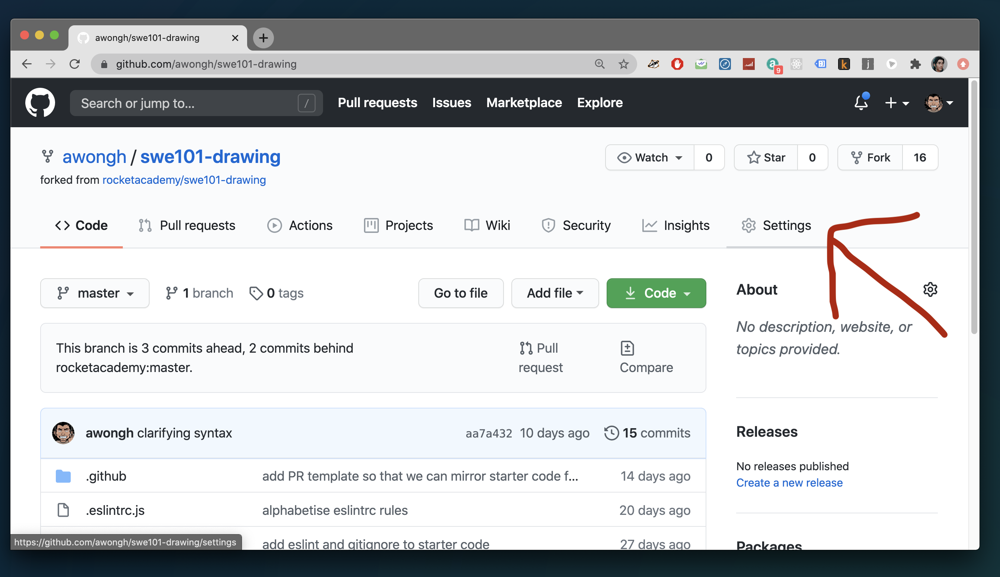
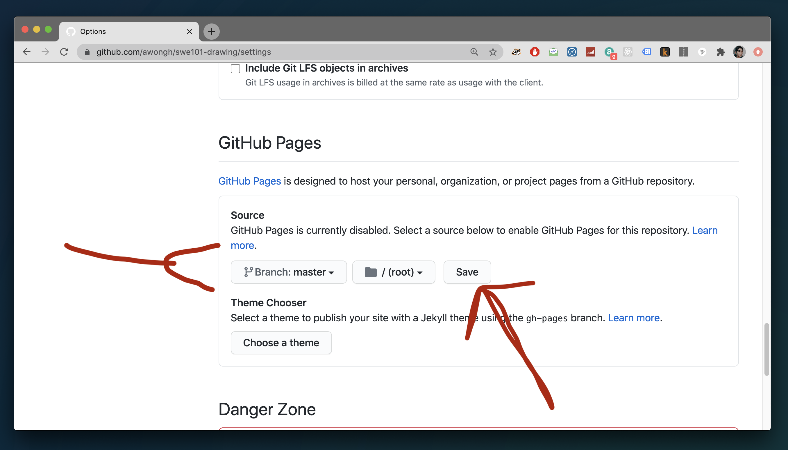

# 12.3: Deployment

In order to make your repo code accessible to anyone on the internet you only need to follow a few steps on the GitHub repo page.

1. Navigate to the settings page of the repo.

2. Scroll down to the GitHub Pages section and click the dropdown

3. Select the `master` branch. 

4. Click the save button.

5. The page will refresh and when you scroll back down to the GitHub pages section the URL of your repo will be displayed there.


Note that if for any reason you changed around any of the file structure of the repo this may not work correctly right away.  
  
`index.html` needs to be at the root of the repository.


