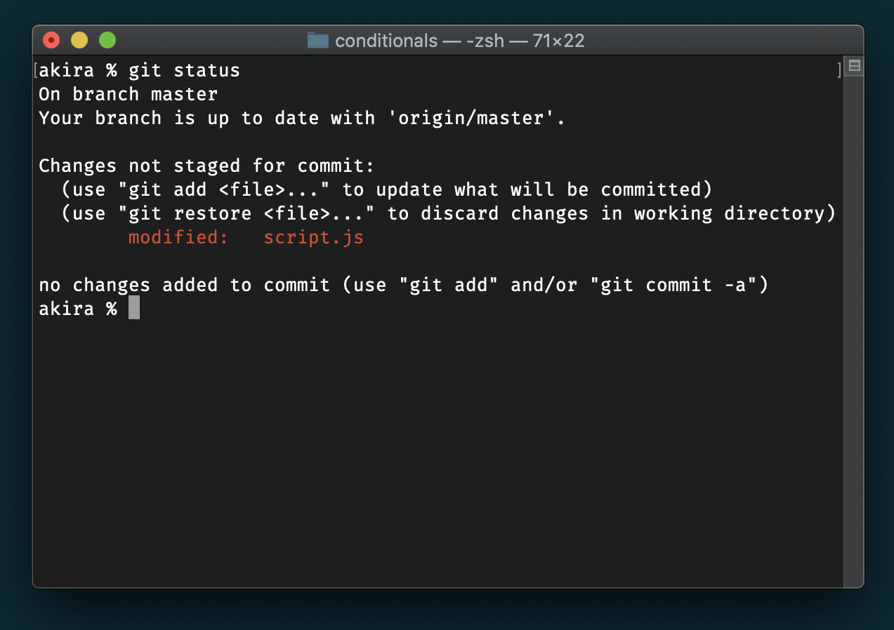

# 2.2: Git



## 

## Version Control

Version control is a system that allows you to track the changes over the lifetime of a file. A system like this isn't limited to code, and isn't limited to text files. It could be used for video files or other assets, or other text files such as contracts or articles.

## Git

Git is the specific version control application we'll be using. It was invented by the same person who invented Linux, to help coordinate large complex software projects between distributed teams of engineers.

## Why

The process of version control is a fundamental part of being a software engineer, and of developing a complex software project.

In this course you'll use that same process to keep track of your work, and submit your assignments using  the web app GitHub.


## Repository

The foundation of the system is a repository ****\(repo for short\). This is a folder that holds all the code **for one project.**

## Commits

A Git repo consists of a time series of commits in the order that they were recorded in the Git system. A commit contains a set of changes **to one or more files.**

These changes can be changes to the contents of a file, but also include adding of a new file, deletion of a file, or renaming or moving a file.

A single commit can contain changes to many files.

## Commands

In this course we'll be using the command line to run Git. 


Most commands accept a path \(unix path\) argument -  denoted below as `<path>`, but if you leave it blank it means `.` \(current unix directory\)



Creating a repo inside a repo can cause problems. If you are in the command line and you can do `git status` at that point, you are already inside a repo. Don't do `git init` in this directory.


### init

```text
git init
```

`git init` is the command to create a completely new repository. Note that we will not be using this command that often- most of the time we'll use starter code.

### status

```text
git status <path>
```

`git status` is the command to see the current status of the repo.



### diff

`git diff` is the command that shows the changes made \*within\* a file.

```text
git diff <path>
```

### 


### add

`git add` is the command that stages files. In Git, creating a commit happens in 2 steps.

1. At least one file is added to Git commit _staging with the_ `add` _command_.
2. A commit is created with the commit command

Staging is that state of a repo that prepares the group of files for a commit.

```text
git add <path>
```


### commit

`git commit` creates the commit record in the repo. You must use the `-m` option to include a \*commit message\* a short sentence about what you changed.

```
git commit -m "message that describes the changes"
```


Running `git commit` without `-m` might bring you into the `vi` editor. If you get stuck in `vi` type `esc` key and `:q!` to get out.


### log

Finally, to see a list of the commits in this repo \(including the one you just created\) use `git log`

```text
git log
```


**Follow along with the steps in the video to create your own repo with a plain text file inside it.**


## Cheat Sheet

Create a repo:

```text
git init
```

Repo status:

```text
git status
```

Changes in a file:

```text
git diff
```

Begin process of committing by adding files to staging: 

```text
git add <file>
```

Create commit

```text
git commit -m "fixed spelling errrror"
```

See newly created commit

```text
git log
```


