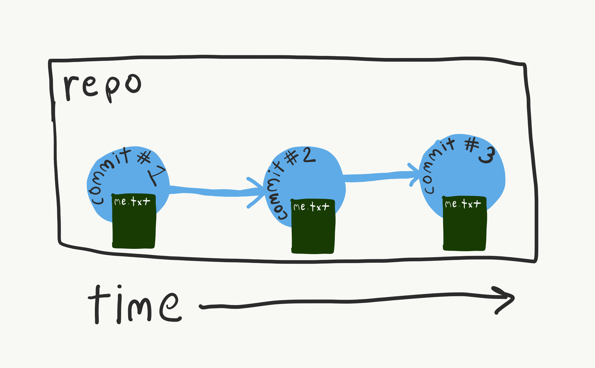
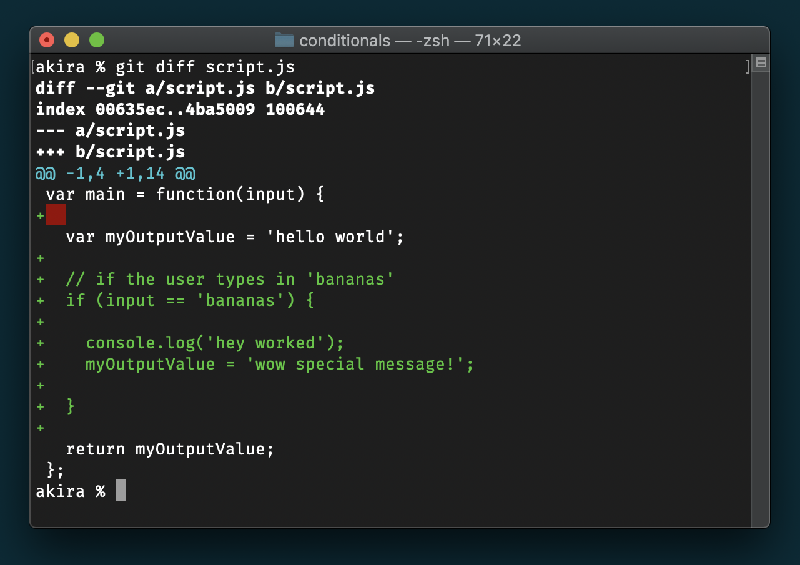
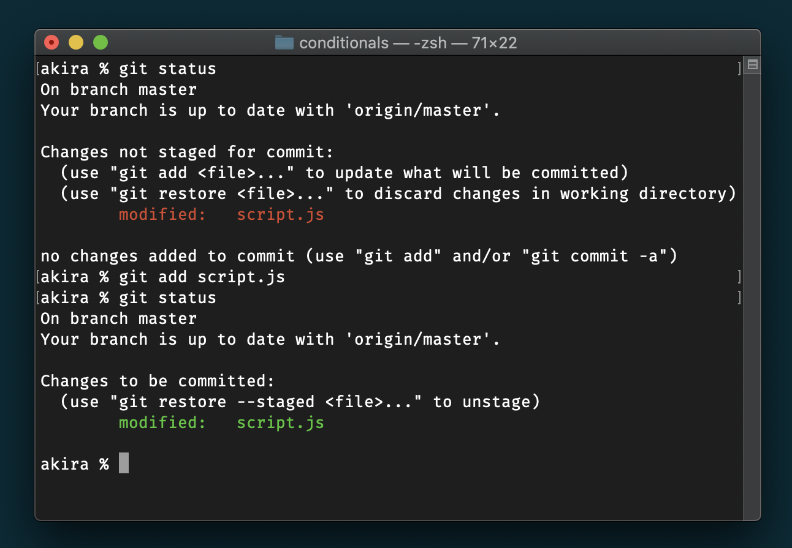

# 2.2: Git

## Introduction



## Version Control

Version control is a system that allows us to track changes over the lifetime of a file. A system like this isn't limited to code, and isn't limited to text files. It could be used for video files or other assets, or other text files such as contracts or articles.

The process of version control is a fundamental part of being a software engineer, and of developing a complex software project. In this course we'll use version control to keep track of our work, and submit our assignments using the web app GitHub.

## Git

Git is the most popular version control system for developers, and the version control system we'll be using. It was invented by the same person who invented Linux, to help coordinate large complex software projects between distributed teams of engineers.

## Git Terminology



### Repository

A core concept in Git is the Repository, or Repo for short. ****This is a folder that holds all the code for one project.

### Commits

A Git repo consists of a time series of commits in the order that they were recorded in the Git system. A commit contains a set of changes to one or more files.

These changes can be changes to the contents of a file, but also include adding of a new file, deletion of a file, or renaming or moving a file.

## Git Commands

In this course we'll be using the command line to manipulate Git. There are other ways to manipulate Git, including several GUI applications, but the command line is the most canonical and widely-used way to manipulate Git.

### init

```text
git init
```

`git init` is the command to create a new Git repository. We will not be using this command often in SWE101. Most of the time we will download starter code with `git clone`.


Creating a repo inside a repo can cause problems. If we are in the command line and running `git status` doesn't throw an error, we are already inside a Git repo. Don't do `git init` or `git clone` in this directory.


### status

```text
git status
```

`git status` is the command to see the current status of the repo. This is typically used to see which files are "staged for commit" in green, and which files are "not staged for commit", in red. To be staged means that if we were to run `git commit` at that moment, the changes to the staged files would be included in the commit.


### diff

`git diff` is the command that shows the changes made within a given file or directory.

```text
git diff <path>
```




Often our changes will be longer than the terminal window height, and `git diff` will open a special menu to navigate these changes. To exit this menu, use `q`, as suggested in [2.1: Command Line's Troubleshooting section](2.1-command-line.md#troubleshooting-the-command-line).


### add

`git add` is the command that stages files for commits. Staging is a label for a group of files, where all "staged" files will be included in the next commit. `git status` will show us which files are staged and not staged. Staged files will appear in green, and not staged files in red. In Git, creating a commit happens in 2 steps.

1. At least one file is labeled as "staged" with the `add` command.
2. A commit is created that includes the staged files with the `commit` command

```text
git add <path>
```



### commit

`git commit` creates the commit record in the repo. We must use the `-m` option to include a "commit message", a short sentence about what we changed. Commit messages typically include **what** and **why** a change was made.

```text
git commit -m "message that describes the changes"
```


Running `git commit` without `-m` might bring you into the `vi` editor. If you get stuck in `vi` type `Esc` and `:q!`, followed by `Enter` to get out.



The first time you make a Git commit you may encounter an error asking you to run the following commands:

```text
git config --global user.name "First Name Last Name"
git config --global user.email "example@example.com"
```

This is normal. Git is asking us to set our Git identity so that any commits we make are tied to our name and email. Once you run those commands, you should be able to make commits as expected.


### log

Finally, to see a list of the commits in this repo \(including the one you just created\) use `git log`

```text
git log
```


Eventually our list of commits will be longer than the terminal window height, and `git log` will open a special menu to navigate this list. To exit this menu, use `q`, as suggested in [2.1: Command Line's Troubleshooting section](2.1-command-line.md#troubleshooting-the-command-line).


## Cheat Sheet

Create a Git repo

```text
git init
```

Check repo status, e.g. which files are staged

```text
git status
```

View changes in unstaged files

```text
git diff
```

Mark file\(s\) as "staged" to prepare them for commit

```text
git add <FILE_NAME>
```

Create a commit with currently-staged files

```text
git commit -m "fixed spelling error"
```

View past commits

```text
git log
```

## **Exercises**

Follow along with the steps in the video to create your own repo with a plain text file inside it.

