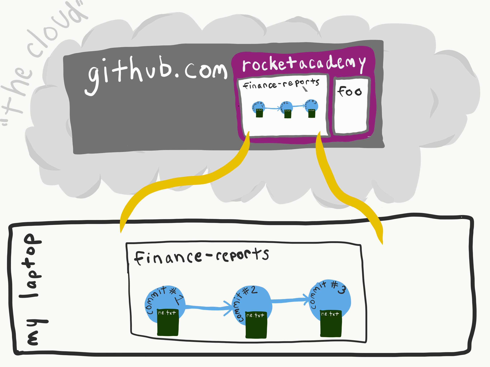

# 4.1: Intro to GitHub

## Introduction




Since making the Basics course videos, RA renamed this course from SWE101 to Coding Basics. When the video references a folder called `swe101`, please use the name `basics` instead to match our latest instructions. Thank you!


GitHub is a web application that hosts Git repositories on the internet. It is a centralised set of repositories developers use to hold "official" copies of their code.


## Git Clone

We'll use a Git command to download or "clone" a copy of Coding Basics starter code. `<REPO_DOWNLOAD_URL>` is the download URL of our repo, obtained by clicking the Download Code button on the repo's [GitHub page](https://github.com/rocketacademy/basics-starter-code). `<LOCAL_REPO_FOLDER_NAME>` is the name of the folder that is created \(containing the contents of the repo\) when we run the Git command. In Coding Basics, we will typically use the current exercise name as the local repo folder name.

**Command Template**

```text
git clone <REPO_DOWNLOAD_URL> <LOCAL_REPO_FOLDER_NAME>
```

**Sample Command**

```text
git clone https://github.com/rocketacademy/basics-starter-code.git basics-starter-code-test
```



GitHub enables us to coordinate differences between local and "official" versions of the code, but we won't concern ourselves with that just yet.

## Exercises

Follow along with the video to create a copy of the Coding Basics starter code repo. You'll find the repo download URL at the repo [GitHub page](https://github.com/rocketacademy/basics-starter-code).


Since making the Basics course videos, RA renamed this course from SWE101 to Coding Basics. When the video references a folder called `swe101`, please use the name `basics` instead to match our latest instructions. Thank you!


