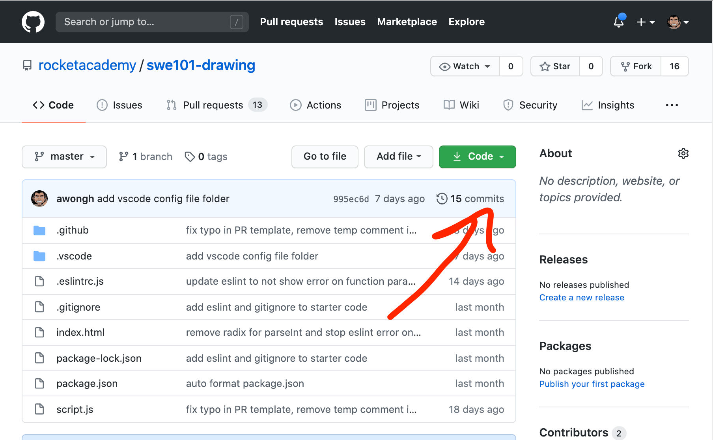
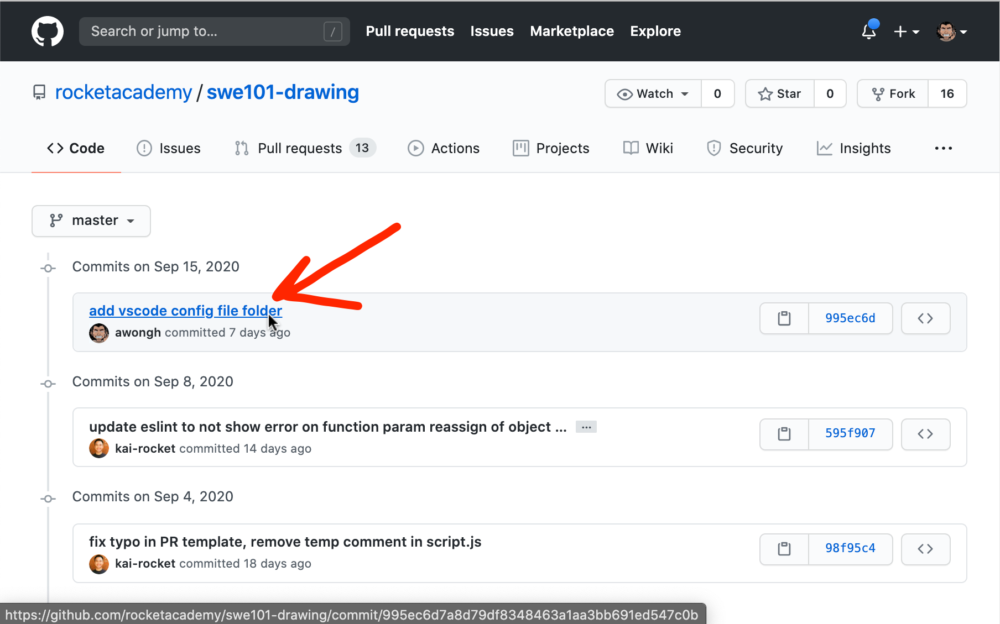
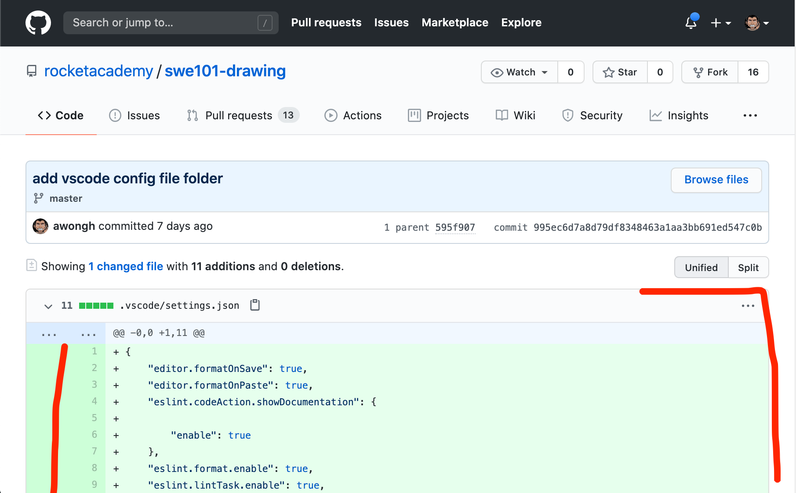
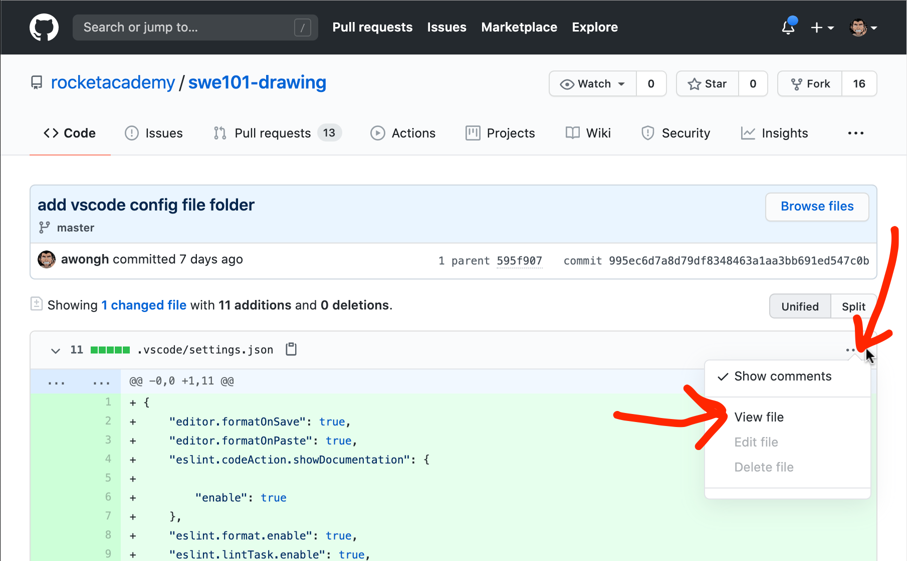
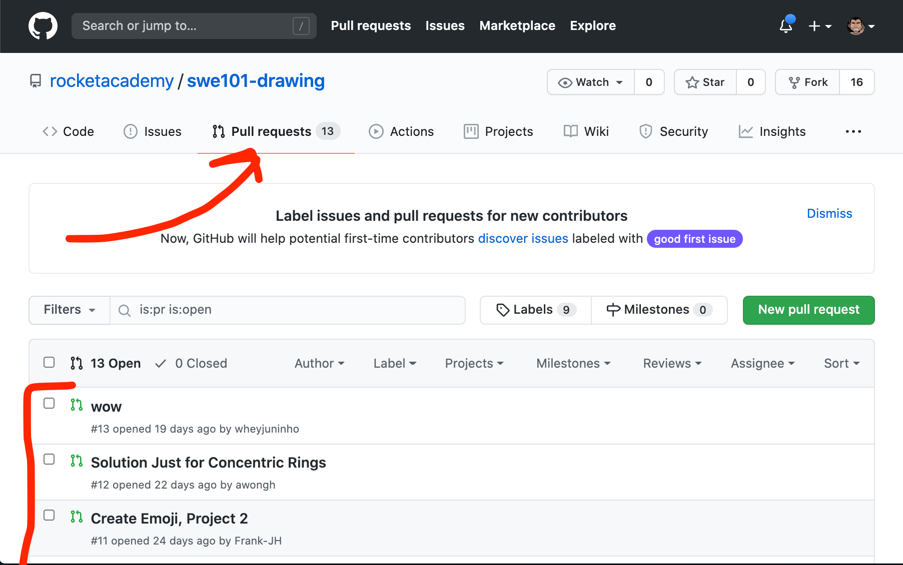
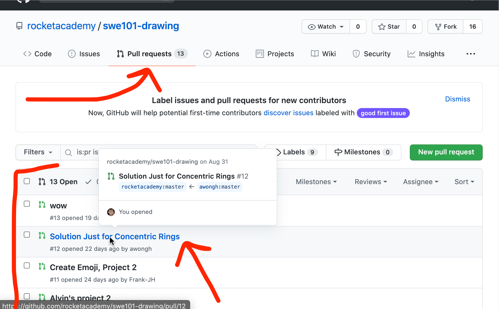
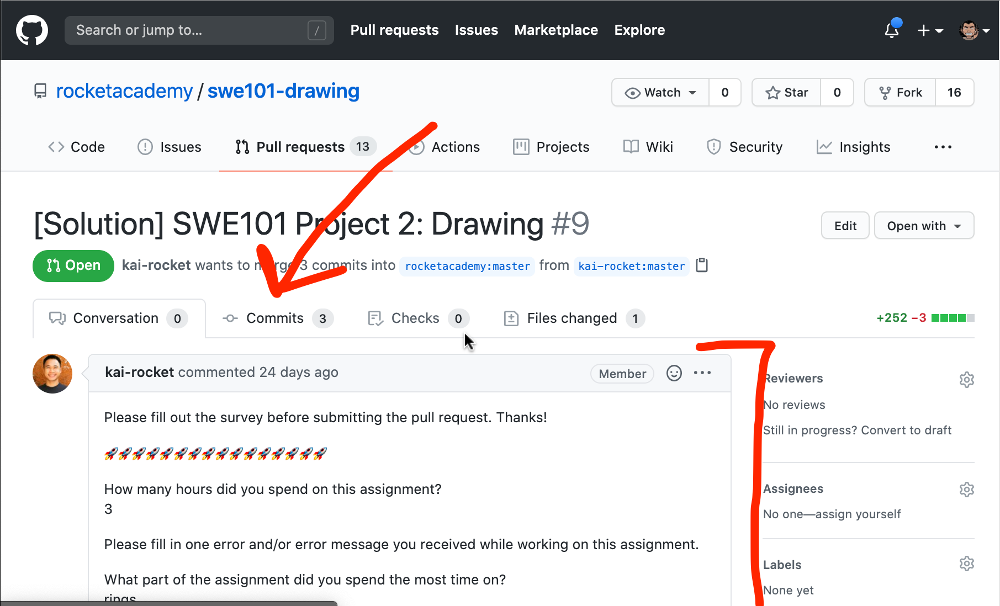

# 7.2: Github Repo Browsing



In order to be able to use the full power of Git you should be able to see all \*contents\* of all previous commits.

This is possible within the command line interface of Git, but is easier displayed inside of the GitHub website. 

Familiarize yourself with everything the GitHub website can display about your repo.

### Repo and Commit Navigation

### Pull Request Navigation


**Do you want to undo something from a previous commit?**

You can rollback your entire repo with the `git revert` command, but for the most part \(especially within swe101\) it will be easier to simply copy the relevant code from a previous version directly from the github website, then save these changes into a new commit.



Follow along with the video to see things about your own repo.


