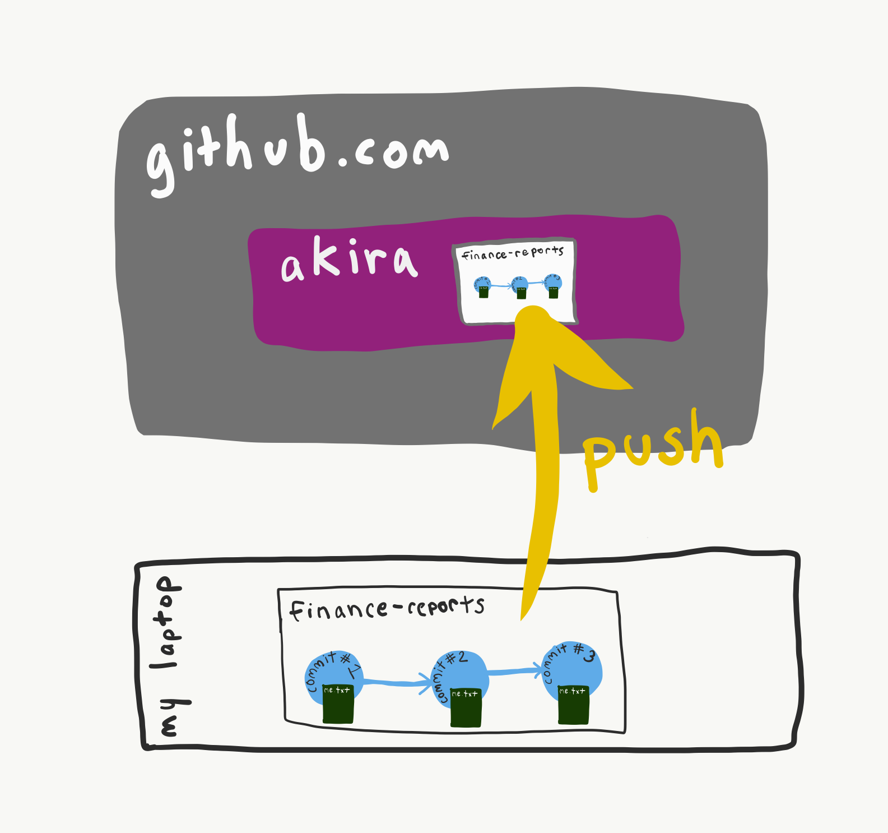
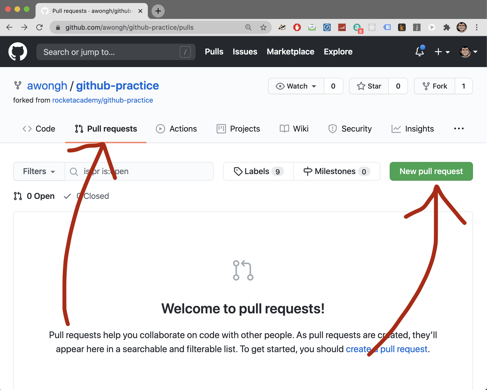

# 7.1: GitHub Fork and Pull Request



We'll begin submitting the assignments we have during the course through Git and GitHub.

We need to know a bit more about the structure of the repos we'll have and how they work.

Remember that GitHub is the web / cloud app that is built upon the Git version control system. GitHub extends the capabilities of Git by itself by adding things like social features, visual code browsing and things like "fork" and "pull requests".

Use this page and video as a resource if you forget or get lost while submitting an assignment / starting an assignment.

## GitHub Fork

A "fork" is the GitHub term for copying a repo from one GitHub account to another. We can do it by clicking the button on a given GitHub repo page.

GitHub fork allows you to make changes to a repo and save them to your own account's copy of the repo. \(And, your account's repo is now basically independent from the original, forked repo\).

"Fork" is a GitHub-only concept. It is not something that happens _within_ the git version control system.

## Git Push

We'll be learning one new Git command `push` in order to get the commits and code from your laptop to GitHub.

`push` is the command to move code between "remote" repos and isn't just used for the specific purpose of getting code to GitHub, but this is the only way we'll use push during the course.

## GitHub Pull Request



A GitHub pull request is how we'll submit the assignments.

When you've pushed your changes to the repo, you'll click the "pull request" button to create a new pull request.

## GitHub Repo Browsing

Use the power of the GitHub website app to browse your code and all your old versions.

## Cheatsheet

Here is the workflow you'll be using for the assignments:

1. Go to the assignment repo page. Click the "fork" button to copy the repo to your own GitHub account.
2. On your computer in the command line, clone the repo _from your own Github account's copy of the repo._
3. Once the repo is on your computer, follow the normal workflow / cheatsheet for Git from [here](../2-organising-and-managing-code-files/2.2-git.md#cheat-sheet).
4. `git push` your changes to your repo. Refresh the repo page to see your commits on the repo.
5. Create a pull request in GitHub. This connects your work on the repo _in your account_ to the original Rocket Academy repo. Fill in the survey and submit.

## Exercises

### Follow Along

Follow along with the video and create a fork and pull request of the [`github-practice` repo](https://github.com/rocketacademy/github-practice).

