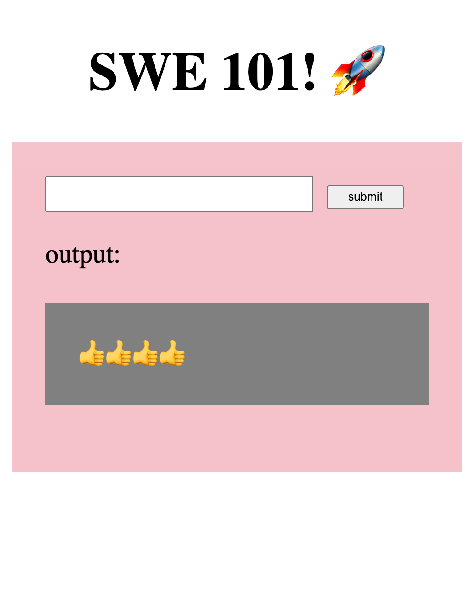
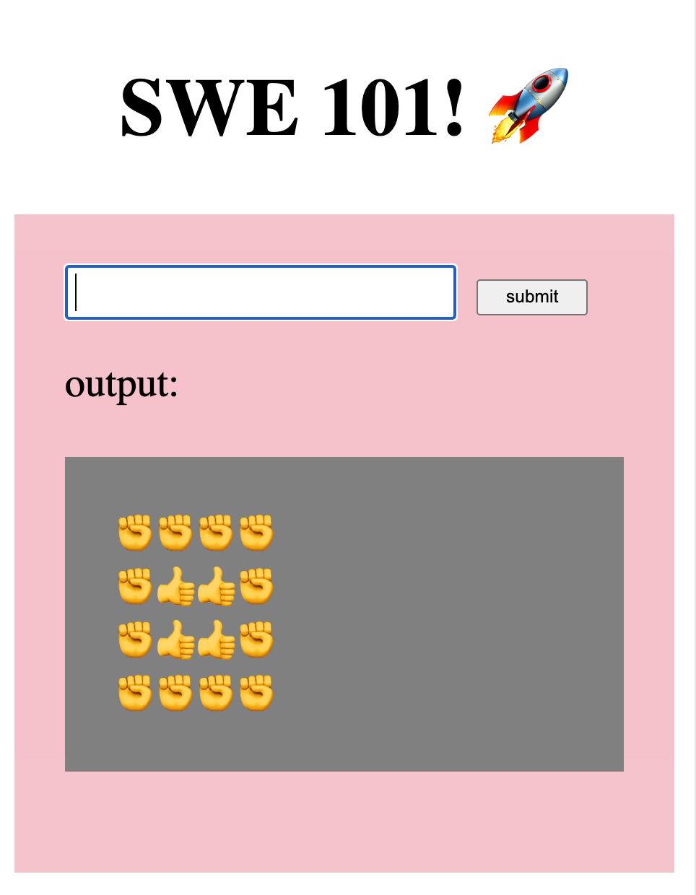

# 9.2: Loops



We've defined an array and looked inside of it and added values, but we don't yet have anything that can deal with the entire array. Or specifically that can deal with **each** item in the array, when the array is an arbitrary length.

For that we are going to add the last control structure we'll use, **loops**.

In the context of games we'll see a few uses of loops that don't have to do with arrays, but from the point of view of software that manipulates input data, the concept of the loop is very much tied to the concept of the array.

A loop defines a **block** of code \(with curly braces\) that will run a set number of times.

A loop relies on a **condition** to tell it to keep running or not.

We'll look at loops in isolation first, then we'll see that they match up perfectly with how an array works.

## while

This is a loop that runs 10 times.

```js
var counter = 0;
while (counter < 10) {
  console.log('hello');
  counter = counter + 1;
}
```

## Outputting Program

Let's create a program that outputs things in a loop based on some input.

```javascript
var main = function (input) {
  var myOutputValue = '';

  var counter = 0;

  while (counter < input) {
    myOutputValue = myOutputValue + 'yes';

    counter = counter + 1;
  }

  return myOutputValue;
};
```


Note that except for some rare exceptions, the increment of the counter \(`counter = counter + 1`\) should be the last statement in the loop block. Don't write any statement below that, it's most likely not what you intended.


### Outputting Program with Logic



Let's create a program that outputs things in a loop based on some input. If we put a conditional inside the loop we can have it output two types of things.

```javascript
var main = function (input) {
  var myOutputValue = '';

  var counter = 0;
  while (counter < input) {
    if (counter < 5) {
      myOutputValue = myOutputValue + 'yes';
    } else {
      myOutputValue = myOutputValue + 'no';
    }
    counter = counter + 1;
  }

  return myOutputValue;
};
```

#### Logic Variations

Just with the combination of loops and conditionals we have a very powerful set of tools to create a set of  output patterns.

By using the property of counter alternating between odd and even numbers we can get an output that alternates.


Note that one of the main tricks to working with loops is being able to identify the pattern you want to create and working backwards from there to construct the logic within the loop and without to get that pattern.

Many patterns will be a combination of this creation of a repeating pattern like here with `%` and some more specific global conditions like the example above.  


```javascript
var counter = 0;

while (counter < input) {

  // see if counter is even
  // % is the remander of division
  // so if a number divided by 2 has no remainder, it is even
  // the output will alternate btwn yes and no
  if( counter % 2 == 0 ){
    myOutputValue = myOutputValue + 'yes';
  }else{
    myOutputValue = myOutputValue + 'no';
  }
  counter = counter + 1;
}
```

## Loops and Functions



We can combine a loop and a function together, effectively moving a block of code outside the loop definition. \(Obviously you can also do the reverse- put a loop inside a function\).

We can use the `diceRoll` function elsewhere and it also helps to keep our code clean inside the loop block.

```javascript
var diceRoll = function () {
  // produces a decimal between 0 and 6
  var randomDecimal = Math.random() * 6;

  // take off the decimal
  var randomInteger = Math.floor(randomDecimal);

  // it's anumber from 0 - 5 ... add 1
  var diceNumber = randomInteger + 1;

  return diceNumber;
};

var main = function (input) {
  var myOutputValue = '';

  var counter = 0;

  while (counter < input) {

    // roll the dice inside the loop  
    var roll = diceRoll();
    myOutputValue = myOutputValue + ' ' + roll + ' ';

    counter = counter + 1;
  }

  return myOutputValue;
};
```

## Loops and Loops - Outputting Program with Dimensions



Let's create a program that outputs things in a loop based on some input. If we put another loop inside the loop we can represent other _lines_ of output.

Note we are using `<br>` to create a new line.

```javascript
var main = function (input) {
  var myOutputValue = '';

  var lineCounter = 0;

  while (lineCounter < input) {
    var columnCounter = 0;
  
    while (columnCounter < input) {
      myOutputValue = myOutputValue + 'x';

      columnCounter = columnCounter + 1;
    }

    // start a new line
    myOutputValue = myOutputValue + '<br>';
  
    lineCounter = lineCounter + 1;
  }

  return myOutputValue;
};
```



#### for loops

There are other variations on the syntax we have shown above which also have the same behavior of repeating a set of code over and over again. \(for, for in, forEach iterator, etc.\).

One syntax that you will encounter on the internet quite often is the `for` loop syntax:

```javascript
for ( var counter=0; counter<10; counter=counter+1 ) {
  console.log('hello');
}
```

You may also see the incrementation step replaced by: `counter++`. \(All this does is add one to `counter`\).

The key thing to know about this syntax \(that we believe is confusing\), is that **the steps in the for loop syntax are rearranged to the top parenthesis group**, but when the code runs, each step actually **happens in the same order as in the while loop example.**

These steps are: 1\) create counter variable 2\) evaluate condition 3\) increment counter 4\) evaluate condition, etc.

For that reason we suggest you stick with while loops until you are very comfortable with the mechanic of the loop syntax.


## Exercises


**1\) Implement the above code.**

**2\) Drawing**

Use loops to create an app that draws emojis into the grey box.

Begin the app by **forking** this repo: [https://github.com/rocketacademy/swe101-drawing](https://github.com/rocketacademy/swe101-drawing)

## Number of Characters

The user will enter a number of characters to display on the screen.

For example, if the user enters 4 they will see this:



## Square

The user will enter the dimensions of a square to display on the screen.

Use a loop within a loop and the `<br>` tag in your output to create the square.

For example, if the user enters 4 they will see this:


## More Comfortable

## Triangle

The user will enter the dimensions of a triangle to display on the screen.‌

Use a loop within a loop, a conditional and the `<br>` tag in your output to create the triangle.

For example, if the user enters 4 they will see this:


### Outline Square

The user will enter the dimensions of a square to display on the screen. The square is outlined by a different character.

For example, if the user enters 4 they will see this:



## Submit

[Push](../7-github/7-1-github-fork-and-pull-request.md#git-push) the commits in your local repo to GitHub. [Create a pull request](../7-github/7-1-github-fork-and-pull-request.md#github-pull-request) to submit your assignment. Please fill in the questionnaire in the pull request comments when you submit.

## Reference Solution

Please find a reference solution [here](https://github.com/rocketacademy/swe101-drawing/pull/9/files). Note that there are many ways to code solutions to these problems and the reference solution is only 1 way.

