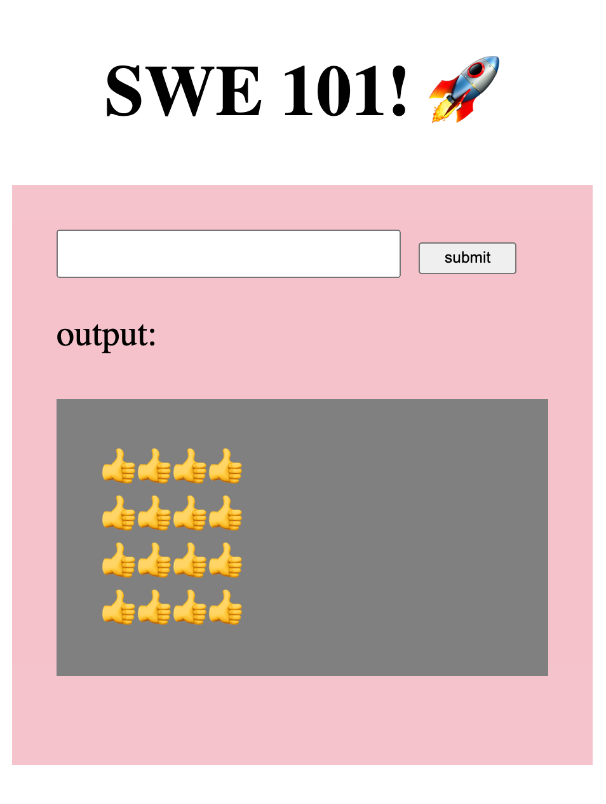
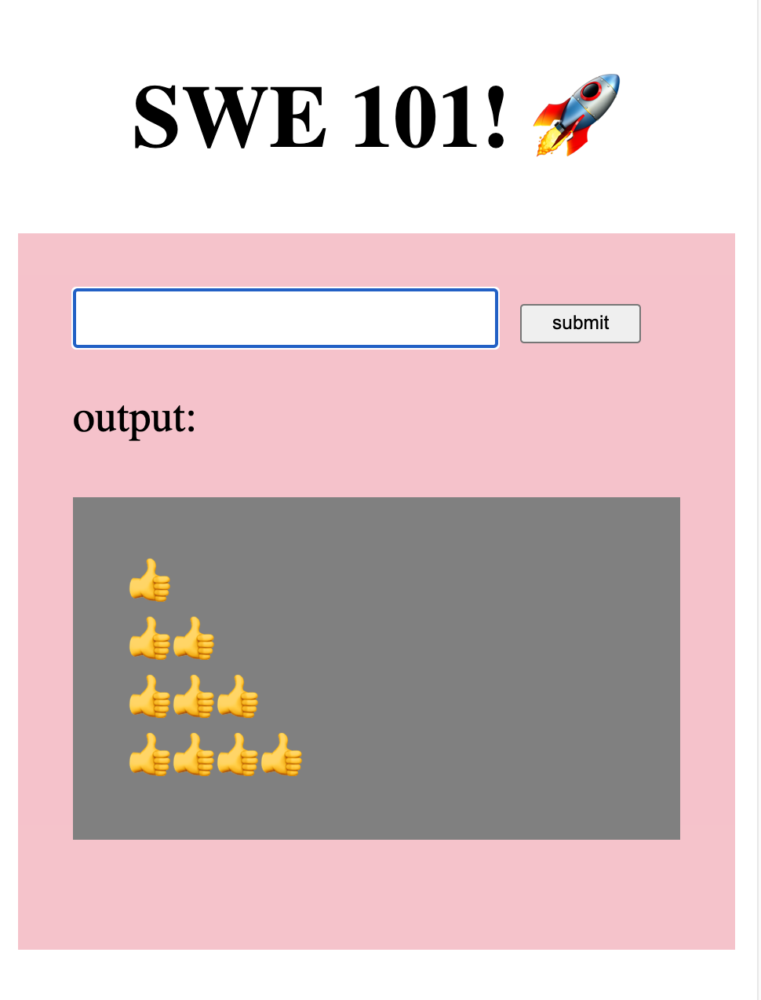

# 9.2: Loops

## Learning Objectives

By the end of this lesson, you should be able to:

* Explain how loops are used in the control flow of a program.
* Use a `while` loop to run a code block for a fixed number of times.
* Use loops within loops.
* Be familiar with both the `for`-loop and `while`-loop syntax.

## Introduction



We've defined an array, added values to it, and inspected those values individually, but haven't yet learned how to systematically manipulate each element in the array, no matter how long the array is. To do this we will learn 1 more control structure: "**loops"**.

In Coding Basics we will mostly use loops to iterate over array elements. Loops can also be used without arrays, for example to perform an action until a condition is no longer `true`, but we will not see this often in Coding Basics.

A loop defines a** code block** (with curly braces) that runs until the loop condition is no longer met. We'll look at loops in isolation first, then see them in the context of arrays.

### While Loop

While loops are the most fundamental type of loop in programming, and the concept exists in many programming languages. The following is a "while loop" that runs 10 times, i.e. until its condition is no longer met. Notice how we define a counter before the loop, and increment the counter at the end of the loop. The loop finishes when the counter reaches 10.

```javascript
// Initialise a counter to 0.
var counter = 0;
// Set the while loop condition to continue when counter is less than 10.
while (counter < 10) {
  // Log hello with each iteration of the loop.
  console.log('hello');
  // Increment the counter by 1 at the end of each loop iteration.
  counter = counter + 1;
}
```

#### While Loop with Input-Based Condition

Let's create a program that outputs values in a loop, where the loop condition depends on user input.

```javascript
var main = function (input) {
  var myOutputValue = '';
  var counter = 0;
  // Continue the loop while counter is less than the input value
  while (counter < input) {
    // Add 1 "yes" to the output for every loop iteration.
    myOutputValue = myOutputValue + 'yes';
    counter = counter + 1;
  }
  return myOutputValue;
};
```


Note that except for rare exceptions, the incrementation of the counter (`counter = counter + 1`) should be the last statement in the loop block. If you find yourself writing any statements below that, it may not be what you intended.


### Loops and Conditionals



#### While Loop with Input-Based Condition and Conditionals Inside Loop

Let's create a program that outputs values in a loop, where loop condition depends on user input, with additional conditional statements inside the loop. In the following example, the conditionals inside the loop help the program combine 2 different strings into program output.

```javascript
var main = function (input) {
  var myOutputValue = '';
  var counter = 0;
  // Continue the loop while counter is less than the input value
  while (counter < input) {
    // If counter is less than 5, add "yes" to output
    if (counter < 5) {
      myOutputValue = myOutputValue + 'yes';
      // Otherwise, add "no" to output
    } else {
      myOutputValue = myOutputValue + 'no';
    }
    counter = counter + 1;
  }
  return myOutputValue;
};
```

#### Conditional Logic Variations

Loops and conditionals alone are powerful tools to create output patterns. One of the main tricks with loops is identifying the pattern we want and working backward to construct the logic within the loop. The following example uses the modulus (`%`) operator in a conditional in a loop to alternate strings in output.

```javascript
var main = function (input) {
  var myOutputValue = '';

  var counter = 0;
  while (counter < input) {
    // If counter is even, add "yes" to output
    // The modulus (%) operator returns the remainder after division
    // If a number divided by 2 equals 0, we consider it even.
    if (counter % 2 == 0) {
      myOutputValue = myOutputValue + 'yes';
      // Otherwise, add "no" to output
    } else {
      myOutputValue = myOutputValue + 'no';
    }
    counter = counter + 1;
  }

  return myOutputValue;
};
```

### Loops and Functions



We can also combine loops and functions. Functions in loops allow us to move code blocks (i.e. complex logic) outside loop definitions, breaking down our code into smaller components, helping simplify our code logic.

In the following example, we define `rollDice` as a standalone function, and call `rollDice` from inside our loop. This helps keep our loop logic clean by separating the details of `rollDice` out from the loop.

```javascript
var main = function (input) {
  var myOutputValue = '';
  var counter = 0;
  while (counter < input) {
    // Roll dice inside the loop, generating a random dice roll each iteration
    var diceRoll = rollDice();
    // Add each dice roll to output
    myOutputValue = myOutputValue + ' ' + diceRoll + ' ';
    // Increment counter at end of each iteration
    counter = counter + 1;
  }
  return myOutputValue;
};
```

### Loops and Loops



### Nested Loops to Simulate Dimensions

If we put a loop inside a loop we can represent 2 dimensions of output. Note we use `<br>` to create new rows. `<br>` is a newline HTML tag that can help us format our output.

```javascript
var main = function (input) {
  var myOutputValue = '';
  // Initialise the outer counter, rowCounter
  var rowCounter = 0;
  while (rowCounter < input) {
    // Inside the outer loop, initialise the inner counter, columnCounter
    var columnCounter = 0;
    // Every time the outer loop runs, the inner loop runs repeatedly until
    // the inner loop condition is met.
    while (columnCounter < input) {
      // Each time the inner loop runs, it adds "x" to output
      myOutputValue = myOutputValue + 'x';
      columnCounter = columnCounter + 1;
    }
    // At the end of each outer loop, add a <br> tag to begin a new row
    myOutputValue = myOutputValue + '<br>';
    rowCounter = rowCounter + 1;
  }
  // After the outer loop has run to completion, return the output compiled
  // by the above loops.
  return myOutputValue;
};
```

## For Loops

Most languages have variations on the while loop above that behave similarly. One common variation is the "for loop". For loops are a more concise syntax for looping over a fixed number of iterations. Whenever we have a fixed number of iterations we should use a for loop if possible. The 2 following examples behave the same, but the for loop syntax is more concise.

### While Loop Syntax

```javascript
// Initialise counter
var counter = 0;
// Declare loop condition
while (counter < 10) {
  console.log('hello');
  // Increment counter
  counter += 1;
}
```

### For Loop Syntax

```javascript
// Initialise counter, declare loop condition, and increment counter in 1 line
for (var counter = 0; counter < 10; counter += 1) {
  console.log('hello');
}
```

The key difference in for loop syntax is that **all loop management code is consolidated in the top parenthesis group**. However, when the code runs, each step actually **happens in the same order as in the while loop example**. These steps are the following.

1. Declare and initialise counter variable
2. Evaluate condition
3. Increment counter

To solidify understanding of loops, we suggest using while loops until you are comfortable with loop mechanics.


In other code examples you may see the incrementation step replaced by `counter++`. This adds 1 to `counter`. At RA we prefer ESLint's recommendation of `counter += 1` syntax. See ESLint's reasons against `++` syntax [here](https://eslint.org/docs/rules/no-plusplus).


## Base Exercises

### Follow Along

Implement the above code.

### Drawing Intro

Use loops to create an app that draws emojis into the grey box. Begin the app by **forking** this repo: [https://github.com/rocketacademy/basics-drawing](https://github.com/rocketacademy/basics-drawing). See [here](https://support.microsoft.com/en-us/windows/windows-10-keyboard-tips-and-tricks-588e0b72-0fff-6d3f-aeee-6e5116097942) for how to input Emoji on Windows and [here](https://support.apple.com/en-sg/guide/mac-help/mchlp1560/mac) for how to input emoji on Mac.

### Number of Characters

The user will enter a number of characters to display on the screen.

For example, if the user enters 4 they will see this:

.png>)

### Square

The user will enter the dimensions of a square to display on the screen.

Use a loop within a loop and the `<br>` HTML tag in your output to create the square.

For example, if the user enters 4 they will see this:



## More Comfortable Exercises

### Triangle

The user will enter the dimensions of a triangle to display on the screen.‌

Use a loop within a loop, a conditional and the `<br>` HTML tag in your output to create the triangle.

For example, if the user enters 4 they will see this:



### Outline Square

The user will enter the dimensions of a square to display on the screen. The square is outlined by a different character.

For example, if the user enters 4 they will see this:


## Exercise Reference Solution

Please find a reference solution [here](https://github.com/rocketacademy/basics-drawing/pull/9/files). Note that there are many ways to code solutions to these problems and the reference solution is only 1 way.
