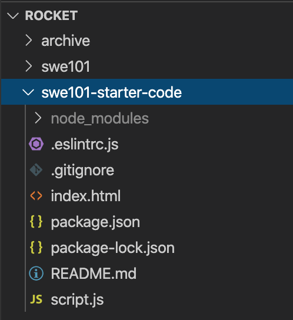

# 💡 Pro Tips

## Window Snapping

On both Windows and MacOS, there are features to automatically snap windows to standard places on your screen. This is especially helpful when, say, you are coding, and you want to view your code on one side and documentation on another. Without window snapping we need to manually drag our windows and resize them. With window snapping, we can get our windows in the right size and place with a single swipe or keyboard shortcut.

### Windows

Window snapping is built-in to windows, and you can take advantage of it with instructions [here](https://support.microsoft.com/en-sg/help/4027324/windows-10-snap-your-windows).

### Mac

Window snapping is not built-in to MacOS, and we will need to download an external program to snap windows. We recommend any of the following. 

1. [Magnet](https://magnet.crowdcafe.com/) \(S$5\) is an actively maintained window snapping app on the Mac App Store.
2. [Spectacle](https://www.spectacleapp.com/) \(free\) is similar to Magnet, but is no longer actively maintained, which means that it may stop working when Apple makes changes to MacOS.

## Using Slack Effectively

### Asking Questions

The ability to ask technical questions effectively is one of the biggest differences between junior and senior engineers. Junior engineers may ask questions like: "It doesn't work. Could you help?" Senior engineers tend to ask questions more like: "Program A is giving me Error X. I didn't expect X to happen because of Logic B. When I googled X, it tells me that this may be related to Y, but I don't see Y anywhere in the system."

In SWE101, we want to start acting like senior engineers. Your section wants to help you, and Slack is a convenient way to get help 24/7, but for others to help effectively, we need to give them context. When asking questions in Slack, try to include the following, while including any relevant context or google results.

1. What is the problem?
2. What is your hypothesis?
3. What have you tried?

## Using VSCode Effectively

### Opening Folders in VSCode

When working with code, it's often necessary to jump between different files in the same repository, or even across repositories. Instead of using File &gt; Open to open a specific _file_ each time, we can save time by opening the _folder_ that contains all the files we may want to access. We can do this on Windows by going to File &gt; Open Folder, or on Mac with File &gt; Open, and selecting the relevant folder. This will open the folder and its file structure in the VSCode sidebar, allowing us to quickly jump between files in that folder without having to File &gt; Open every time.

### Comment Out Multiple Lines at Once

Sometimes we wish to enable or disable certain segments of our code for quick testing. The easiest way to do this is to "comment out" the code we want to disable by turning it into comments, making our JavaScript runtime ignore those lines of code.

Rather than adding `//` to the start of each line manually, VSCode has a shortcut that allows us to comment out multiple lines simultaneously. To do this, select all lines we wish to comment out, then use the keyboard shortcut Ctrl+/ on Windows, or Cmd+/ on Mac.

### Editing a Variable Name in Multiple Places Concurrently

Sometimes we want to change the name of a variable in our code, a common practice in [refactoring](https://en.wikipedia.org/wiki/Code_refactoring). If that variable is used in multiple places, we may be tempted to edit each instance individually. Luckily VSCode has a convenient feature that allows us to edit all instances of the same variable simultaneously, saving time and our fingers.

#### Within a Single File

1. Move your cursor to the first instance of the variable
2. Press/hold Ctrl+D on Windows or Cmd+D on Mac until all instances of that variable are selected
3. Use left or right arrow keys to enable cursors on each instance of that variable and edit them simultaneously

#### Across Multiple Files

VSCode has a [search and replace feature](https://code.visualstudio.com/docs/editor/codebasics#_search-across-files) that allows us to edit all instances of a given string in multiple files at once.

### Hide Minimap

The [VSCode minimap](https://code.visualstudio.com/docs/getstarted/userinterface#_minimap) is displayed by default in VSCode to show one's vertical position within a file. This may not be necessary in SWE101 and we can hide the minimap for more space in VSCode. Hide the minimap by toggling View &gt; Show Minimap in the menu bar.

## Organising Folders for SWE101

In SWE101 we will be creating many folders and cloning the starter code multiple times. To keep things organised, I recommend the following folder structure. Note that all files and folders are in lowercase and kebab case \(hyphenated\) for ease of use on the command line.

1. Host all SWE101 code in a folder called `swe101`. Keep this somewhere accessible like your  `Documents` folder.
2. Within the `swe101` folder, for each class session \(there are 13 total\) in SWE101, create a new folder for that day. This means you will have 13 day-specific folders, such as `day1`, `day2`, ..., `day13`.
3. Within each `dayX` folder, create 1 folder for homework exercises and another folder for class-time exercises. These can look like `homework` and `class`, or any other naming scheme that works for you.
4. Within `homework` and `class` folders, keep a separate folder for every exercise you do that requires you to create a new Git repository or clone a new copy of the SWE101 starter code. When cloning the starter code, you can choose to [name the target folder](../4-getting-started-with-code/4-1-intro-to-github.md#clone) to the relevant exercise name. This is so that we do not end up with Git repositories within Git repositories, which can confuse Git and cause issues.

