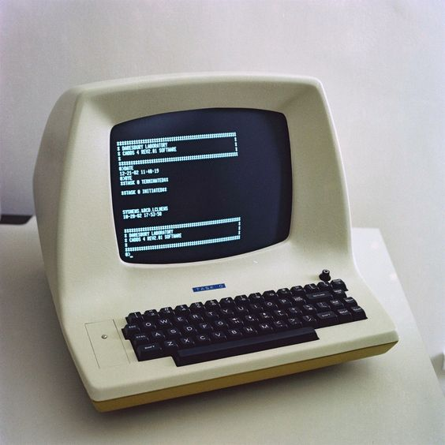

# 💻 Required Hardware and Software

## Required Hardware

1. Desktop or laptop computer running the latest version of Windows or MacOS.
2. Webcam and microphone capable of enabling video conferencing on your computer. These are built-in for most laptops.

## Required Software

1. Slack
2. Zoom
3. VSCode
4. Chrome
5. Node.js
6. Git

### Slack

Slack is RA's primary mode of communication. It allows us to communicate across our school, within sections, and between individuals. Most tech companies internationally use Slack to communicate internally.

#### Installation

1. Download the Slack mobile app from Android's Play Store or iOS's App Store
2. Download the Slack desktop app for your relevant operating system \(OS\) [here](https://slack.com/intl/en-sg/help/categories/360000049043-Getting-started).

### Zoom

Zoom is RA's video conferencing software for live classes. Each section will have its own Zoom link to join for each class. 

#### Installation

1. Download the Zoom Client for Meetings [here](https://zoom.us/download).
2. Start a new meeting to test that your webcam and microphone are working.

### VSCode

VSCode is RA's software editor of choice. It is also the most popular code editor in the world. We will write all code for SWE101 inside of VSCode.

#### Installation

1. Download VSCode for your OS [here](https://code.visualstudio.com/download).
2. Install the ESLint extension for VSCode [here](https://marketplace.visualstudio.com/items?itemName=dbaeumer.vscode-eslint). "ES" stands for ECMAScript, which is the technical specification for JavaScript, and "lint" in a coding context refers to programmatic detection of formatting and syntax errors. ESLint enables us to detect and fix formatting and syntax errors in JavaScript, and the VSCode ESLint extension allows us to do so automatically within VSCode.
3. \[Windows Only\] Verify that the terminal in VSCode can run in the Bash language installed with Git by following [these instructions](https://stackoverflow.com/questions/42606837/how-do-i-use-bash-on-windows-from-the-visual-studio-code-integrated-terminal/50527994#50527994).
4. Verify Node.js is installed by typing `node -v` in your [VSCode terminal](https://code.visualstudio.com/docs/editor/integrated-terminal) and hitting `enter`. This should print out a version number on the next line like `v12.18.3`.  

### Chrome

Chrome is the most popular web browser for software engineers because of its mature developer tools \(we will soon see in course videos\). Chrome also has the largest library of browser extensions, which further help developers build and maintain web software.

#### Installation

1. Download Chrome for your OS [here](https://www.google.com/intl/en_sg/chrome/).

## Command Line Software

### Node.js

Node.js is the most popular JavaScript runtime. "Runtime" in a coding context refers to the environment in which code runs. ".js" is the file extension for JavaScript files, and a common suffix for JavaScript packages. We will use Node.js to lint and run our JavaScript code in non-browser contexts.

#### Installation

1. Download Node.js for your OS [here](https://nodejs.org/en/download/). It will come with NPM, which stands for Node.js Package Manager. Package managers are used to download and manage 3rd-party packages that our programs rely on, such as ESLint.

### Git

Git is the most popular software version control system. All tech companies use version control to manage contributions to and releases of their software. We will be using basic Git during SWE101 to download and upload copies of projects.

On Windows, Git installation also enables us to run our terminal in the Bash programming language. The terminal is the program that allows us to run commands on our computers. Bash is a terminal language used across OSes, allowing us to run commands on our computers in the same way across Windows and Mac. A version of Bash called Zsh \(pronounced "zoosh"\) is installed by default on MacOS.

#### Installation

1. Download Git for your OS [here](https://git-scm.com/book/en/v2/Getting-Started-Installing-Git). 

#### Git for MacOS

Your MacOS installed git should look like this:



#### Command Line Setup For Windows

1. Open Visual Studio Code and press and hold Ctrl + \` to open the terminal

2. Open the command palette using Ctrl + Shift + P.

3. Type - Select Default Shell

4. Select Git Bash from the options

5. Click on the + icon in the terminal window

6. The new terminal now will be a Git Bash terminal. Give it a few seconds to load Git Bash

7. You can now toggle between the different terminals as well from the dropdown in terminal.

8. Repeat the above setups for mac - type in the same commands in the terminal.

