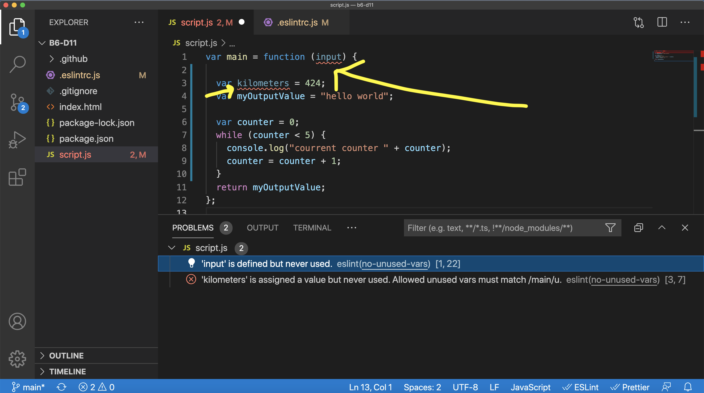
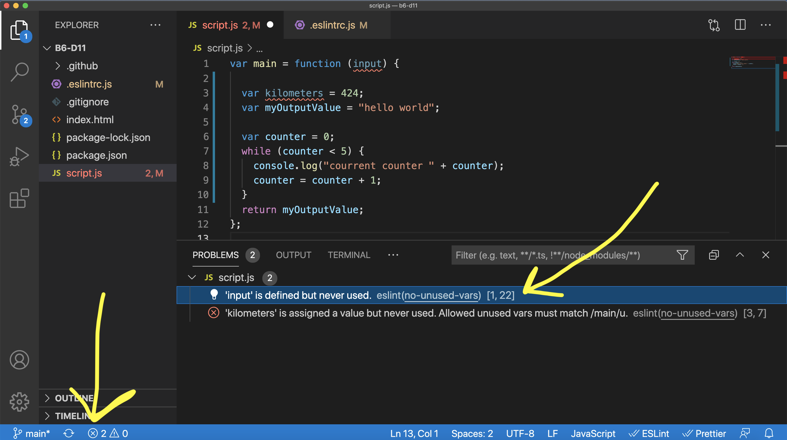
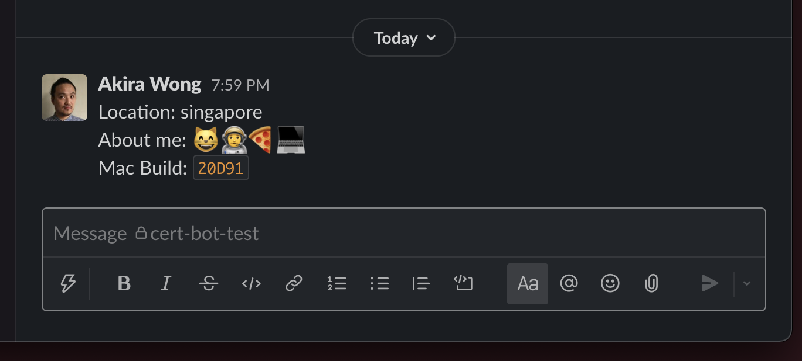

# 💻 Required Hardware and Software

## Required Hardware

1. Desktop or laptop computer running the latest version of Windows or MacOS.
2. Webcam and microphone capable of enabling video conferencing on your computer. These are built-in for most laptops.
3. Internet connection that is able to run Zoom calls with no interruptions in audio or video. If you're not sure, let us know and we can schedule a chat!

## Required GUI-Application Software

GUI-application software is software we run with a graphical user interface \(GUI\) on our operating system.

### Slack

Slack is a chat software and RA's primary mode of communication. It allows us to communicate across our school, within sections, and between individuals. Many tech companies internationally use Slack for internal communication.

#### **Installation**

1. Download the Slack mobile app from the Android Play Store or iOS App Store
2. Download the Slack desktop app for your relevant operating system [here](https://slack.com/intl/en-sg/help/categories/360000049043-Getting-started).


Slack is one of the cornerstone mediums on which this course operates! Please be sure to read through the [Slack House Rules](course-methodology.md#slack-house-rules).


### Zoom

Zoom is RA's video conferencing software for class. Each section will have its own Zoom room. The link to this room can be found at the top of each section's Slack channel.

#### **Installation**

1. Download the Zoom Client for Meetings [here](https://zoom.us/download).
2. Start a new meeting to test that your webcam and microphone are working.

### Chrome

Chrome is the most popular web browser for software engineers because of its mature developer tools, which we will soon see in course videos. Chrome also has the largest library of browser extensions, which further help developers build and maintain software.

#### **Installation**

1. Download Chrome for your OS [here](https://www.google.com/intl/en_sg/chrome/).

### VSCode

VSCode is the most popular code editor in the world. We will write all code for Coding Basics inside of VSCode. Download VSCode for your OS [here](https://code.visualstudio.com/download).

## Required Command-Line Software

Command-line software is software primarily operated from the command line \(we will explain this in a video\) that may not have a graphical user interface we can interact with. This software is typically used by software developers to write programs. Command-line software is not stored in a computer's Applications folder. We'll cover [more about the command line in 2.1.](../2-organising-and-managing-code-files/2.1-command-line.md)

### Git

Git is the most popular software version control system. All tech companies use version control to manage contributions to and releases of their software. We will be using basic Git during Coding Basics to download and upload copies of projects. We'll cover more about Git in [2.2](../2-organising-and-managing-code-files/2.2-git.md), [4.1](../4-getting-started-with-code/4.1-intro-to-github.md) and [7.1](../7-github/7.1-github-fork-and-pull-request.md).

On Windows, Git installation also enables us to run our terminal in the Bash programming language. The terminal is the program that allows us to run commands \(and command line software\) on our computers. Bash is a terminal language used across OSes, allowing us to run commands on our computers in the same way on both Windows and Mac. A version of Bash called Zsh \(pronounced "zoosh"\) is installed by default on MacOS.


_**When copying any commands from the Git website, do not copy the dollar sign \($\) in front of the command.**_ The dollar signs in their commands denote the start of command lines, and are not part of the commands.


## Git - Mac Installation

1. Download and install Git for MacOS by downloading it here: [https://sourceforge.net/projects/git-osx-installer/](https://sourceforge.net/projects/git-osx-installer/)
2. Verify Git is installed by running `git --version` in the [VSCode terminal](https://code.visualstudio.com/docs/editor/integrated-terminal). This should print out a version number on the next line, e.g., `git version 2.28.0`.
3. Download and install the [Git Credential Manager.](https://github.com/microsoft/Git-Credential-Manager-Core/releases/download/v2.0.498/gcmcore-osx-2.0.498.54650.pkg)


To install the Git Credential Manager you may need to allow "unidentified developer apps". \(_But don't worry, Git Credential Manager is created by Microsoft_\) from instructions [here:](https://support.apple.com/en-sg/guide/mac-help/mh40616/mac)

**To override your security settings and open the app, follow these steps:**

1. _In the Finder_  _on your Mac, locate the download file._
2. _Control-click the app icon, then choose Open from the shortcut menu._
3. _Click Open._  


   _The app is saved as an exception to your security settings, and you can open it in the future by double-clicking it just as you can any registered app._



## **Git - Windows Installation**

1. Navigate to the Git website download page and click the download link: [https://git-scm.com/download/win](https://git-scm.com/download/win)
2. Open the downloaded file.
3. The Git install dialog will open. We'll need to set a few options here. The rest will be the default options.
4. Follow [command line setup instructions below](required-hardware-and-software.md#windows-command-line-setup) to set Bash as the terminal language.
5. Verify Git is installed by running `git --version` in the [VSCode terminal](https://code.visualstudio.com/docs/editor/integrated-terminal). This should print out a version number on the next line, e.g., `git version 2.28.0`.




Dialog Options: \(just click _**next**_ for default options\)

* Information \(default\)
* Select Destination Location \(**Copy this or write it down,** [**you will need it for VSCode setup**](required-hardware-and-software.md#vscode-settings-windows)\)
* Select Components \(default\)
* Select Start Menu Folder \(default\)
* Choose the default editor used by Git \(**Choose VSCode**\)
* Adjusting your PATH environment \(default\)
* Choosing HTTPS transport backend \(**choose Use the native Windows Secure Channel Library**\)
* Configuring the line ending conversions \(default\)
* Configuring the terminal emulator to use with Git Bash \(default\)
* Choose the default behaviour of git pull \(default\)
* Choose a credential helper \(default\)
* Configuring extra options \(default\)
* Configuring extra options \(default\)



Git needs to be installed on the same drive as VSCode. If you happen to have 2 drives on your computer, e.g. C and D drives, make sure both VSCode and Git are installed on the same drive.



Don't install anything into Windows OneDrive. 


### Windows Command Line Setup

We will need to use the command line \(also known as a terminal, more on this in a later module\) during Coding Basics. Windows uses a terminal language called PowerShell by default, but this is not what we are going to use, as most software engineers use terminal languages made for Unix-based operating systems, e.g. Linux and MacOS. Windows users will be using GitBash, a Unix-based terminal language for windows. See more on GitBash [here](https://www.gitkraken.com/blog/what-is-git-bash).

Make sure you've already downloaded and installed Git first.

The following instructions are adapted from [Stack Overflow](https://stackoverflow.com/questions/42606837/how-do-i-use-bash-on-windows-from-the-visual-studio-code-integrated-terminal/50527994#50527994).


1. Open Visual Studio Code and open the terminal \(accessed from the top-level menu\). We should see something like the screenshot above, with the word "powershell" in the dropdown menu. If you're not able to open the terminal with the keyboard shortcut, see [here](https://code.visualstudio.com/docs/editor/integrated-terminal) for other ways to open the terminal.
2. Open the command palette using `Ctrl+Shift+P`.
3. Type and select "Terminal: Select Default Profile".
4. Select "Git Bash" from the dropdown.
5. Restart VSCode, close the terminal, and open a new terminal. The terminal should now run with Bash.



If we don't see "bash" or "Git Bash" from the Select Default Profile dropdown, it's possible VSCode isn't sure where to find our Bash installation. In this case, we can manually tell Git where to find it by adding settings to our VSCode settings.

If you have this issue, follow instructions in the [VSCode Formatting Settings section below](required-hardware-and-software.md#vscode-formatting-settings) to tell VSCode to look for Bash where you installed it. Remember to update the file paths to the location of your Bash installation.


We shouldn't need to, but if we need to, we can toggle between different terminal languages from the dropdown in our VSCode terminal.


## VSCode Formatters

### Prettier

Prettier is a code formatter that will auto-format our code and make it more readable when we save our files.

1. Install the Prettier extension for VSCode [here](https://marketplace.visualstudio.com/items?itemName=esbenp.prettier-vscode). 
2. Restart VSCode to activate Prettier.

### VSCode Formatting Settings

1. Open VSCode and open the command prompt with `Ctrl+Shift+P` on Windows and `Cmd+Shift+P` on Mac.
2. Start typing `Preferences: Open Settings (JSON)` and select this option when you see it in the search dropdown. A JSON settings file should open in VSCode.
3. Replace everything on the screen \(in the file\) with the code below.
4. Save the settings file.
5. Restart VSCode to apply our settings.
6. Open and save the settings file again and verify that Prettier auto-formats it as our default formatter.

### VSCode Settings - Mac

```text
{
	"editor.formatOnSave": true,
	"editor.formatOnPaste": true,
	"editor.minimap.enabled": true,
	"editor.tabSize": 2,
	"editor.wordWrap": "on",
	"editor.defaultFormatter": "esbenp.prettier-vscode"
}
```

### VSCode Settings - Windows


Windows users: The following code assumes we installed our Git folder at the root of our C drive. Some students' installers install the Git folder elsewhere, for example in `C:\\Program Files (x86)`.  You should have noted the installation location of Git when you installed it, as per the instructions above.

If your installed Git folder is not in the location as listed below, please edit line 8 and 12 to the appropriate values when you copy these configurations.


```text
{
	"editor.formatOnSave": true,
	"editor.formatOnPaste": true,
	"editor.minimap.enabled": true,
	"editor.tabSize": 2,
	"editor.wordWrap": "on",
	"editor.defaultFormatter": "esbenp.prettier-vscode",
	"terminal.integrated.shell.windows": "C:\\Program Files\\Git\\bin\\bash.exe",
	"terminal.integrated.defaultProfile.windows": "Git Bash",
	"terminal.integrated.profiles.windows": {
		"Git Bash": {
			"path": "C:\\Program Files\\Git\\bin\\bash.exe",
			"icon": "terminal-bash"
		}
	}
}
```

### \[No Action Needed\]  Suggestion Highlighting

As we code, VSCode may suggest fixes to our code by highlighting errors. Some of these suggestions will be optional but others may cause our programs to break.



To discern what problems VSCode is raising, we can view the suggestion messages in the console.



To view messages in the console, use the following steps.

1. Click the error icon in the bottom left of the VSCode footer. This will show the suggestion pane below our code.
2. For each suggestion there will be a line in the suggestion pane with a sentence about what VSCode suggests, and the relevant line number in the code file.

## Required Software Accounts

### GitHub

GitHub is the most popular code-hosting platform. Developers around the world use GitHub to share code and collaborate on projects. Rocket Academy's starter code and project templates are hosted on GitHub, and we will use GitHub in Coding Basics to download, host, and submit assignments. Each student will need a GitHub account to host and submit assignment code.

#### **Sign Up**

Go to [https://github.com/](https://github.com/), click the Sign Up button and follow on-screen instructions.

#### **Git and GitHub Credential Configuration**

Add your GitHub account credentials to your computer through the command line. Please replace `<YOUR_GITHUB_USERNAME>` AND `<YOUR_GITHUB_EMAIL>` with your own GitHub user name and the email you used to sign up to GitHub with. _Note to replace the_ `<>` _characters and keep the_ `"` _characters in the commands._

```text
git config --global user.name "<YOUR_GITHUB_USERNAME>"
```

```text
git config --global user.email "<YOUR_GITHUB_EMAIL>"
```

#### Configuration Check

You will not get any feedback from the terminal after entering these commands.

Type the following command into the terminal to check your work. If you see a `:` at the bottom of the output, you may need to press `Enter` until you see the lines starting with `user.name` and `user.email`.

```
git config -l
```

You should see your username and email in the output, and possibly some other settings.

#### Git default branch configuration

Following the convention of all the other Rocket Academy Git repositories and GitHub, we'll change the default Git branch name by typing in the command shown in the code box.

```text
git config --global init.defaultBranch main
```

## Folder Structure for Coding Basics

In Coding Basics we will be creating many folders and cloning the starter code multiple times. To keep our code organised, we recommend the following folder structure.


All code-related files and folders are in kebab case \(hyphenated and lowercase\), e.g., `file-name.txt` ,  for ease of use on the command line. It is generally a bad idea to name any files or folders with a space in them, e.g., `file name.txt` , because spaces need to be escaped with backslash \(`\`\) on the command line.


1. Host all Coding Basics code in a folder called `basics`. Keep this in your `Documents` folder.
2. Within the `basics` folder, for each class session \(there are 12 total\) in Basics, create a new folder for that day. This means you will have 12 day-specific folders, such as `day1`, `day2`, ..., `day12`.
3. Within each `dayX` folder, create 1 folder for pre-class exercises and another folder for in-class exercises. These can be named  `pre-class` and `in-class`, or any other naming scheme that works for you.
4. Within `pre-class` and `in-class` folders, keep a separate folder for every exercise you do that requires you to create a new Git repository or clone a new copy of the Basics starter code.


As a shortcut, we can run the following command in the terminal to create all the folders.

1. Open the `Documents` folder in VSCode with File &gt; Open Folder and choose `Documents`.
2. Run the following command.

   ```text
   mkdir -p basics/day{1..12}/{in-class,pre-class}
   ```



When cloning the starter code, choose to [name the target folder](../4-getting-started-with-code/4.1-intro-to-github.md#git-clone) to the relevant exercise name. This is so that we do not end up with Git repositories within Git repositories, which can confuse Git and cause issues.



### OneDrive \(Windows only\)

On Windows computers it may not be clear where a given folder is. Some Windows computers are setup to default to the OneDrive cloud folder. This can be double checked by clicking on the window path location arrow at the top of the window to see the full file location path.


**Don't put your Basics folders in OneDrive.** This makes it harder to access them from the command line.



### Open Basics Folder in VSCode

When working with code, it's often necessary to switch between different files in the same repository, or even across repositories. Instead of using File &gt; Open to open a specific _file_ each time, we can save time by opening the _folder_ that contains all the files we may want to access. We can do this on Windows by going to File &gt; Open Folder, or on Mac with File &gt; Open, and selecting the relevant folder. This will open the folder and its file structure in the VSCode sidebar, allowing us to switch quickly between files in that folder without having to File &gt; Open every time.


For Coding Basics, we recommend storing all of your code in a folder called `basics` as per the [recommended folder structure](required-hardware-and-software.md#folder-structure-for-coding-basics), and keeping that folder open in VSCode for the duration of the course.



## Recommended: Window-Snapping Software

On both Windows and Mac there are features to snap windows to standard sizes and places on our screen using keyboard shortcuts. This is especially helpful when coding and we want to view code on one side and documentation on another. The alternative is to manually drag windows and resize them.

**Windows Installation**

Window snapping is built-in to Windows, and you can take advantage of it with instructions [here](https://support.microsoft.com/en-sg/help/4027324/windows-10-snap-your-windows).

**Mac Installation**

Window snapping is not built-in to MacOS, and we will need to download an external program to snap windows. We recommend any of the following.

1. [Rectangle](https://rectangleapp.com/) \(free\) is an actively-maintained open-source window snapping app. We recommend this to start.
2. [Magnet](https://magnet.crowdcafe.com/) \(S$10.98\) is an actively-maintained window snapping app on the Mac App Store. It mostly has the same features as Rectangle, and might be more user-friendly because it's managed through the App Store. From what we can tell, it serves the same function as Rectangle.

## Exercise

**Send your first Slack message!**

Use all the new software you've installed to send your first message to your new course-mates.



#### Send a message with:

1. Your location
2. 4 emojis that describe you
3. The result of running the following command \(depending on your OS\):
4. Anything else you feel like adding 😁.

#### Windows: Your exact windows version

```text
cmd /c ver
```

#### Mac: Build Version of your OS:

```text
sw_vers
```


Don't worry about exactly what's happening in these commands yet! This exercise is just to get you started with typing in the Command Line interface and sending Slack messages. We'll see more about the command line in [2.1 Command Line.](../2-organising-and-managing-code-files/2.1-command-line.md)


