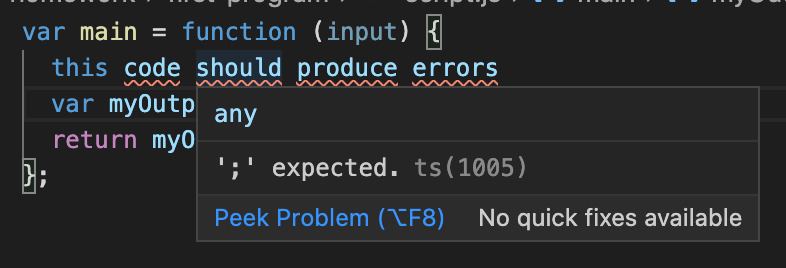

# 💡 Tooling Pro Tips

## Using VSCode Effectively

### View and Fix ESLint Errors

When we run `npm install` each time we clone a repo in SWE101, we are installing a package ESLint that helps us see errors before we run our code. Some of these errors are functional, i.e. the program will not run unless we fix them, and some are stylistic, i.e. ESLint points out these errors so that our code is consistent. Please try to fix all ESLint errors in your code.

VSCode shows us ESLint errors with red squiggly lines under the parts of our code with errors. To see what the error is, hover over the red squiggly line in VSCode.

### Comment Out Multiple Lines at Once

Sometimes we wish to enable or disable certain segments of our code for quick testing. The easiest way to do this is to "comment out" the code we want to disable by turning it into comments, making our JavaScript runtime ignore those lines of code.

Rather than adding `//` to the start of each line manually, VSCode has a shortcut that allows us to comment out multiple lines simultaneously. To do this, select all lines we wish to comment out, then use the keyboard shortcut `Ctrl + /` on Windows, or `Cmd + /` on Mac.

### Editing a Variable Name in Multiple Places Concurrently

Sometimes we want to change the name of a variable in our code, a common practice in [refactoring](https://en.wikipedia.org/wiki/Code_refactoring). If that variable is used in multiple places, we may be tempted to edit each instance individually. Luckily VSCode has a convenient feature that allows us to edit all instances of the same variable simultaneously, saving time and our fingers.

#### Within a Single File

1. Move your cursor to the first instance of the variable
2. Press/hold Ctrl+D on Windows or Cmd+D on Mac until all instances of that variable are selected
3. Use left or right arrow keys to enable cursors on each instance of that variable and edit them simultaneously

#### Across Multiple Files

VSCode has a [search and replace feature](https://code.visualstudio.com/docs/editor/codebasics#_search-across-files) that allows us to edit all instances of a given string in multiple files at once.

### Hide Minimap

The [VSCode minimap](https://code.visualstudio.com/docs/getstarted/userinterface#_minimap) is displayed by default in VSCode to show one's vertical position within a file. This may not be necessary in SWE101 and we can hide the minimap for more space in VSCode. Hide the minimap by toggling View &gt; Show Minimap in the menu bar.

## Watching YouTube Videos at Different Speeds

If the course videos are too fast or too slow for you, you can watch them at slower or faster speeds by [toggling a speed setting in YouTube](https://support.google.com/youtube/answer/7509567?co=GENIE.Platform%3DDesktop&hl=en).

