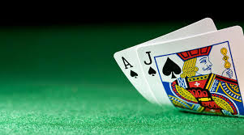

# Project 3: Blackjack Part 1

In this first part of the Blackjack project you'll build the gameplay logic.

Begin the app by **forking** this repo: [https://github.com/rocketacademy/swe101-blackjack](https://github.com/rocketacademy/swe101-blackjack)

## Gameplay

If you haven't played Blackjack before, refer to [this video](https://www.youtube.com/watch?v=eyoh-Ku9TCI) to see what the rules of the game are.

For the purposes of the project we will simplify the rules and the gameplay.

There will be only two players. One human and one computer.

The computer will always be the dealer. The dealer has to hit if their hand is below 17.

The player who is closer to 21 wins the hand. Aces can be 1 or 11.

## How to Start

We know that the gameplay turns will be represented by the `main` function.

**The sequence of actions would be:**

* Deck is shuffled.
* User clicks submit button to deal cards.
* The cards are analyzed for any game winning conditions. \(Blackjack\)
* The cards are displayed to the user.
* Then begins a new action, where the user has to decide whether to hit or stand, using the submit button to submit their choice. 
* When the user makes a decision the cards are analyzed for any winning conditions. They are also analyzed for losing conditions, since it's possible for any player to lose now.
* The computer also decides to hit or stand automatically based on game rules.
* Either the game ends or continues.

_For the user choice to hit or stand, we know that when a new action of the user has different logic means that the game must have a mode to deal with this._

### Prioritizing Work

Given the above is the \*final\* sequence of actions that the user must take in order to play a full game, how do we break these down into sub-features that we can work on one at a time? \(And also verify that they are working one at a time\).

We want to work on things in small parts, but not have to redo any work as we expand the capability of the game, so we want to plan ahead a bit to make sure we can start small and scaffold in the later stages at the same time.

If you already think you have an effective strategy for creating your game, you can skip ahead. If you're not sure how to approach the game, try to apply these strategies to get you started.

Read all the way through before you start. These are just strategies for how to approach breaking down this larger project into smaller tasks and keep your progress and momentum on the project moving. \(Which is actually very important!\)

#### First Version

We want to aim for a playable game. If we think about what the minimal version of a playable Blackjack-like game is, it would be to compare the rank of the cards of the player and dealer. 

What we can leave out is: the Ace being 1 or 11, the player or dealer being able to hit or stand.

Create your winning game condition just comparing these sets of cards to determine a winner. Code with the idea in mind that it will expand later to encompass this other functionality.

Test your code.

#### Second Version

The player hitting or standing is different from the dealer hitting or standing. The rules state that the dealr hits or stands after all the players are done, so we can work on the players hitting or standing first.

The player hitting or standing is a new mode in the game that allows the player to enter their choice. Add the logic for when the player busts.

Refactor your logic to run wait until the player is done to run the winning condition. 

#### Third Version

The rules state that the dealer hits after the player is done. After the player confirms they are done, add the logic for the dealer adding cards to their hand. This should happen before the winning  condition obviously.

#### Fourth Version

Add the part of the logic that deals with the Ace being 1 or 11.

## Tips

* Creating helper functions can be a powerful way to refactor your code and keep it neat.
* Don't be afraid to throw away code, especially if you already know how you would write it better.
* Commit your code often- whenever you have a small working version. \(Each version listed above would be a commit\). Make legible and accurate commit messages so that you can refer to your old changes [through the GitHub website later.](../7-github/7-2-github-repo-browsing.md)

## More Comfortable

### Splits

Add hand splitting functionality to the game. Splitting rules [here](https://en.wikipedia.org/wiki/Aces_and_eights_%28blackjack%29#Splitting). Dealer is not allowed to split.

If the player has two of the same kind of card, they can choose to split and get dealt 2 new cards.

## Reference Solution

Please only refer to the reference solution after you have attempted the project. Thank you!

Note that there are many ways to implement the project and the reference solution is only 1 way.

[https://github.com/rocketacademy/swe101-blackjack/pull/3/files](https://github.com/rocketacademy/swe101-blackjack/pull/3/files)

